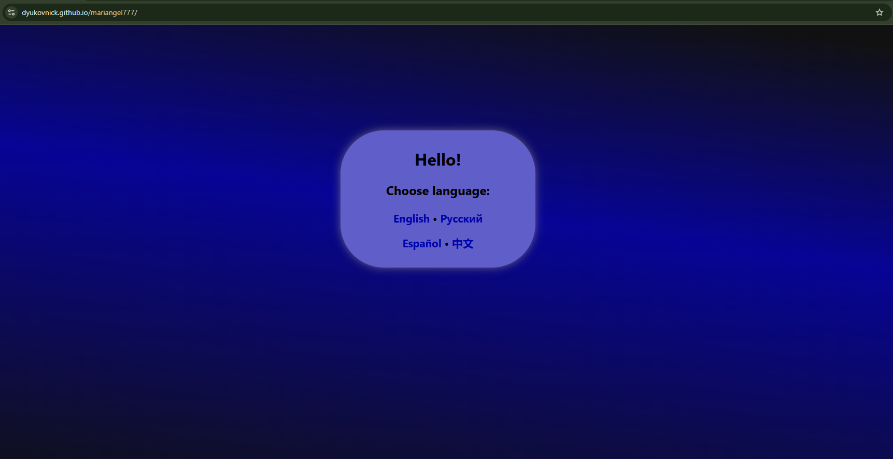
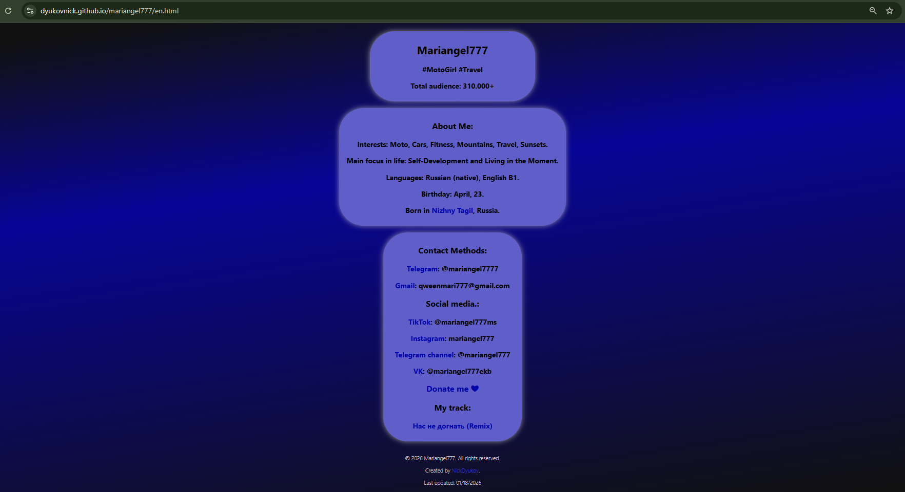

# Personal Blogger Website

Multilingual website for a blogger

## About the project
- Personal blog with support for multiple languages: Russian, English, Spanish, and Chinese.
- Fully responsive design, optimized for desktop and mobile devices.
- Built using pure HTML and CSS.
- Created on: January 18, 2026.

## Features
- Language selection on the main page.
- Clean, minimalist design with a focus on content.
- Links to blogger's social media and contact information.

## Usage
Open «index.html» in a browser to navigate to the desired language.

## Screenshots

##  Live Demo
[Open website](https://dyukovnick.github.io/mariangel777/)

## Author
Nikita Dyukov  
GitHub: [dyukovnick](https://github.com/dyukovnick)
